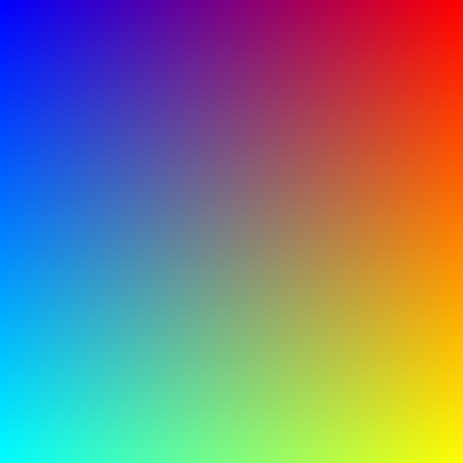
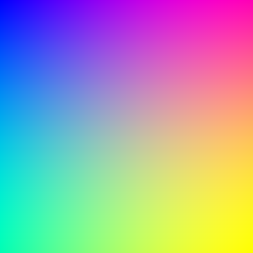

# draw
En Go, usando librería gg. Pruebas con distintos dibujos 

## Dibujos
### DrawBasic
Dibuja colores hasta W y H usando suma para red(izq->der) y green(arr->abj) y resta para blue(
izq+arr->der+abj)

### drawSin
Dibuja colores hasta W y H usando Sin para red (izq->der) y green(arr->abj) y Cos para blue(
izq+arr->der+abj)

